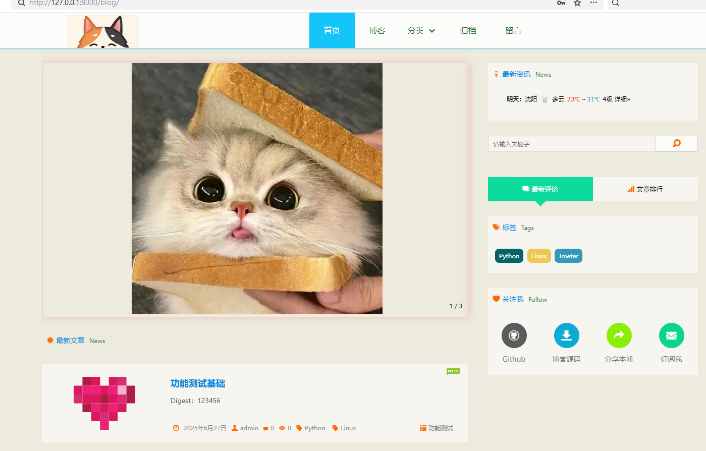
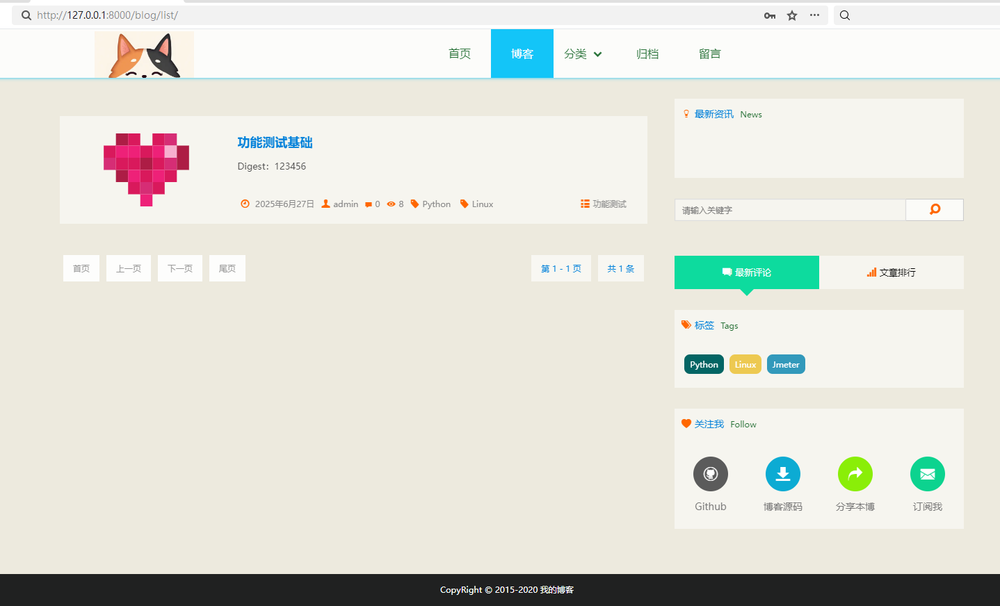
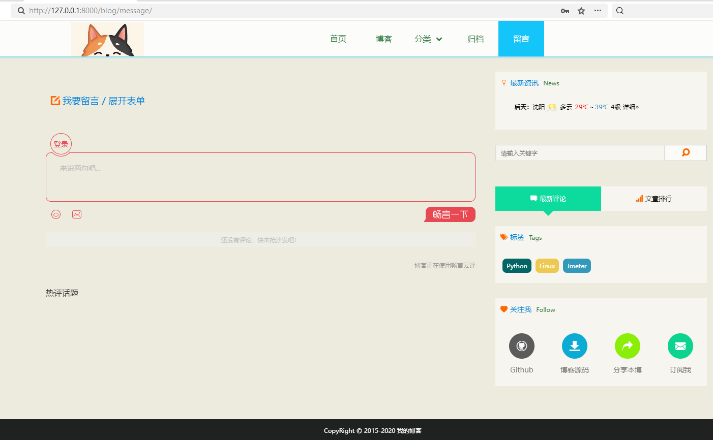

## Django搭建博客
 


使用Django快速搭建博客
### 要求
* Python: 3.5
* Django: 2.2.0

### 下载
```
wget https://github.com/xljdawow-lj/blog/archive/master.zip
or
git clone git@github.com:xljdawow-lj/blog.git
```

### 安装
```
pip install -r requirements.txt  # 安装所有依赖
修改setting.py配置数据库
配置畅言：到http://changyan.kuaizhan.com/注册站点,将templates/blog/component/changyan.html中js部分换成你在畅言中生成的js。
畅言js位置: 畅言管理后台-》安装畅言-》通用代码安装-》自适应安装代码
python manage.py makemigrations blog
python manage.py migrate
python manage.py runserver
```
[文档](docs/install.md)

### 使用

```python
# 初始化用户名密码
python manage.py createsuperuser
# 按照提示输入用户名、邮箱、密码即可
# 登录后台 编辑类型、标签、发布文章等
http://ip:port/admin

```

浏览器中打开<http://127.0.0.1:8000/>即可访问

## Screen Shots

* 首页


* 文章列表


* 文章内容


# 清空并重新生成 staticfiles文件夹，生产专用
python manage.py collectstatic --noinput --clear

# 启动服务器，生产环境用的80端口
waitress-serve --host=0.0.0.0 --port=8000 django_blog.wsgi:application

# 本地启动服务器
py manage.py runserver

# 使用本地.env虚拟环境
在pycharm，鼠标右键点击“打开于”选择“终端”

# 创建虚拟环境
python -m venv .env

# 打开终端，可能自动激活，如果没有，手动运行
.\.env\Scripts\activate.bat
